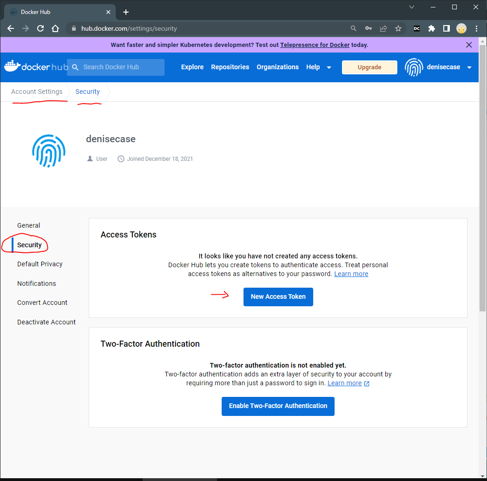
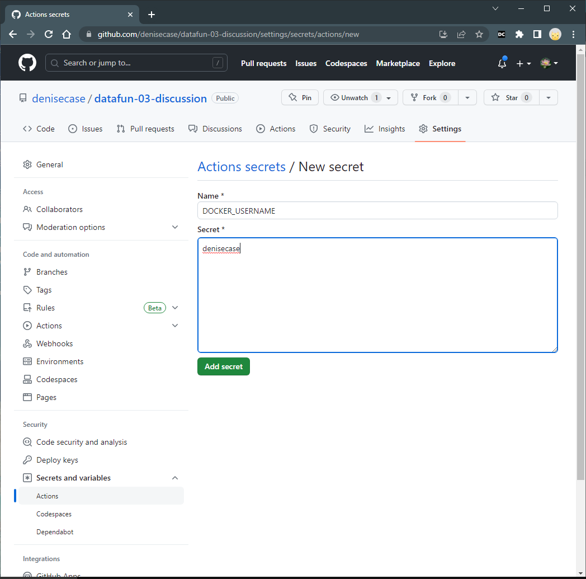
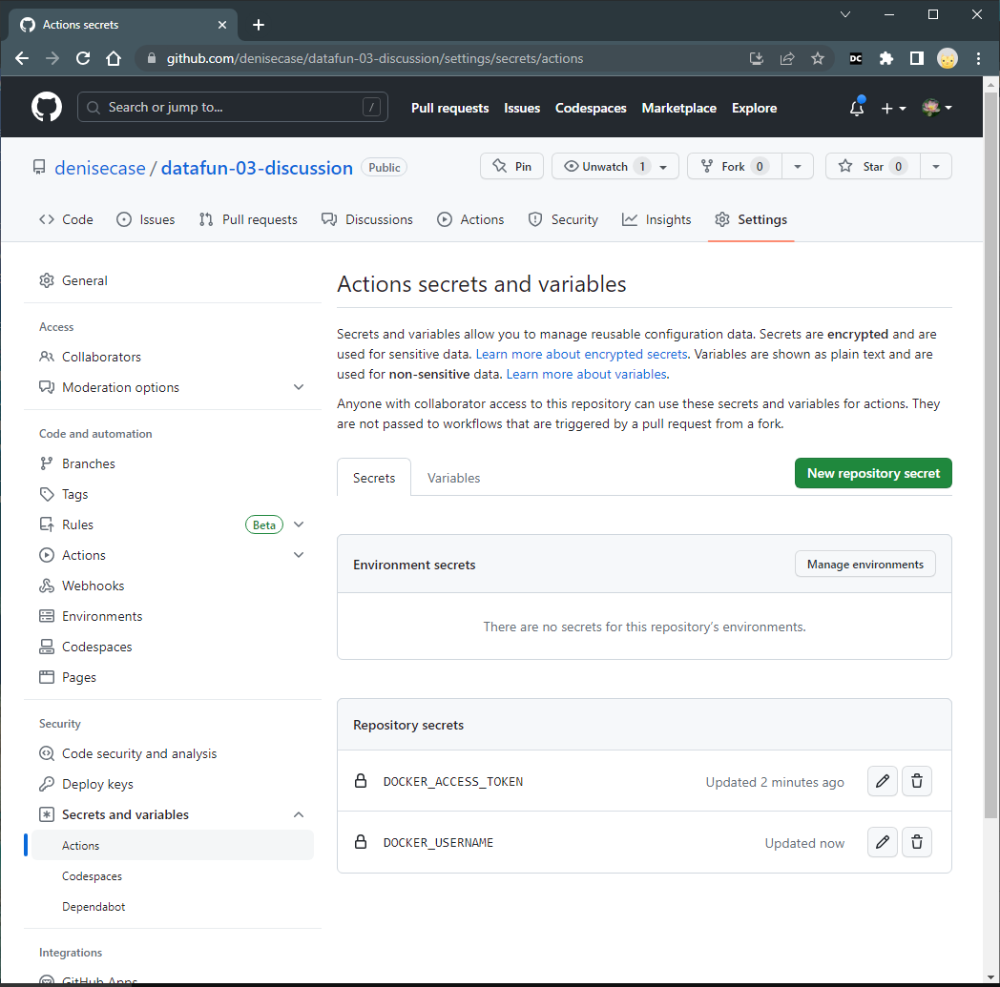

# Publish to Binder

1. Have a `requirements.txt` file in the root of your GitHub repository. List the names of the Python packages your notebook depends on, one per line. See the example in this repo. 

2. Navigate to [https://mybinder.org/](https://mybinder.org/).

3. Enter the URL of your GitHub repository, e.g., https://github.com/denisecase/datafun-03-discussion/.

4. In the field that says "Path to a notebook file (optional)", enter learning.ipynb with the "File" option displayed.

5. Click "Launch". 

6. Binder will create a Docker image of your repository, installing the packages listed in your `requirements.txt` file. This may take a while the first time, but should be faster on subsequent builds.

7. Once the build process completes, Binder will provide a URL.

8. Users can visit this URL to run your notebook in an interactive environment.

🚀 Rocket Tip: Follow the instructions to expand the badge section. 
Copy the code for the Binder badge to your README.md file and 
paste it just below the title. 
This provides a clickable link to your notebook.

Explore more examples at <https://github.com/binder-examples/>.

## Binder Configuration: postBuild

A postBuild file is a script run after the project is built on Binder. 
We use it to install and enable ipywidgets and the Jupyter Notebook extensions configurator.

The jupyter_nbextensions_configurator is used to configure the Jupyter Notebook extensions configurator, a graphical user interface for enabling and disabling Jupyter notebook extensions.

## Binder Rate Limits

Rate limits of 100 container image requests per six hours for anonymous usage, 
and 200 container image requests per six hours for free Docker accounts are now in effect. 
Image requests exceeding these limits will be denied until the six hour window elapses.

## Get DockerHub Access Token

Sign up for DockerHub at <https://hub.docker.com/>.

Create an access token at <https://hub.docker.com/settings/security>.
Copy it to your clipboard - you'll need to copy that into GitHub.

## Add Secrets to GitHub

Add [.github/workflows/deploy.yml](.github/workflows/deploy.yml) to your repo.
Note the required secrets we'll need to add those to our GitHub account.

In your GitHub repo, go to Settings / Secrets and variables / Actions and add the two repository secrets.

