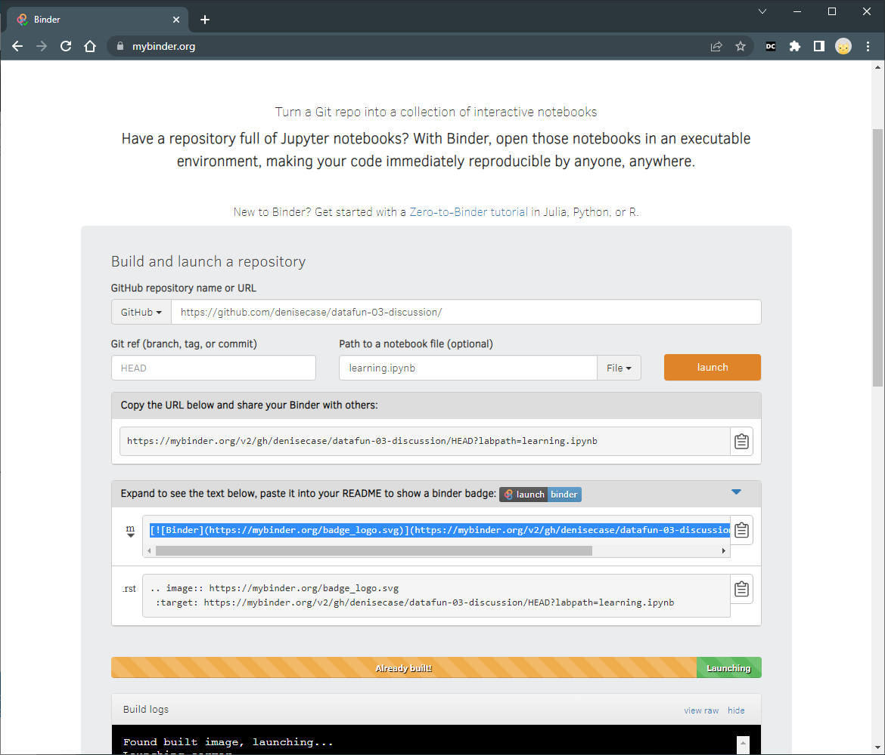

# Publish to Binder

1. Add a `requirements.txt` file to the root of your GitHub repository. List the names of the Python packages your notebook depends on, one per line. See the example in this repo. 

2. Navigate to [https://mybinder.org/](https://mybinder.org/).

3. Enter the URL of your GitHub repository.

4. In the field that says "Path to a notebook file (optional)", you can enter the path to a Jupyter notebook. If you leave this field blank, Binder will start with the contents of the repository's root directory.

5. Click "Launch". 

6. Binder will create a Docker image of your repository, installing the packages listed in your `requirements.txt` file. This may take a while the first time, but should be faster on subsequent builds.

7. Once the build process completes, Binder will provide a URL.

8. Users can visit this URL to run your notebook in an interactive environment.

🚀 Rocket Tip: Follow the instructions to expand the badge section. 
Copy the code for the Binder badge to your README.md file and 
paste it just below the title. 
This provides a clickable link to your notebook.

Explore more examples at <https://github.com/binder-examples/>.