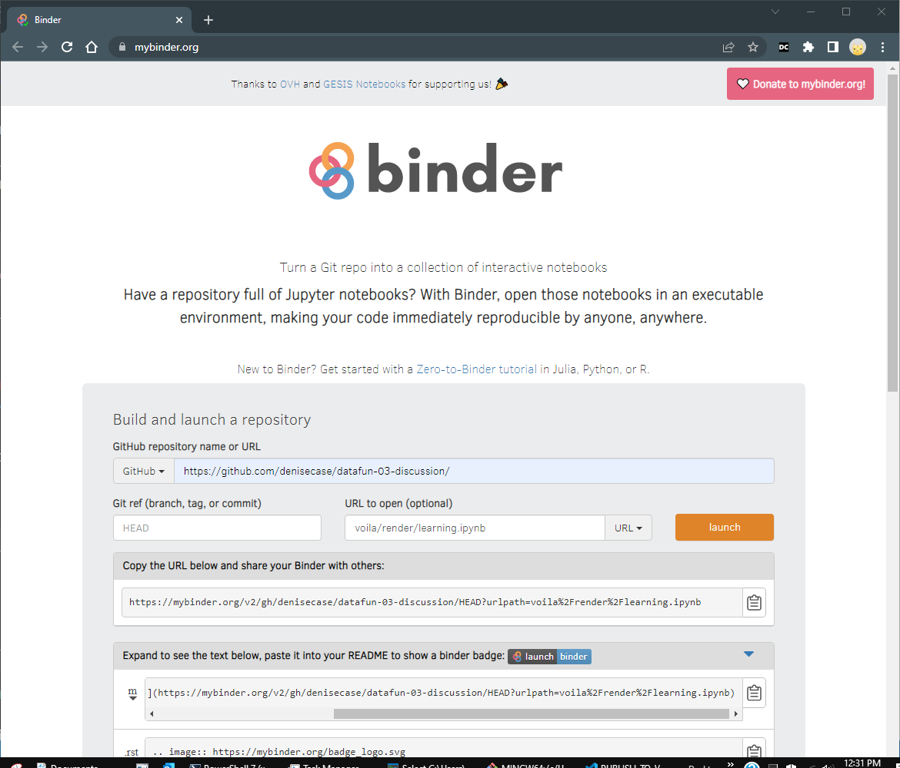

# Publish to Voilà 

Voilà and ipywidgets turn Jupyter notebooks into interactive web applications. 

## Install Voilà

**Deactivate** the virtual environment and 
install voila into your default Python environment. 

```shell
deactivate
python -m pip install --upgrade voila
```

## Run Voilà and View Notebook

Once installed, you can run `voila` in the terminal followed by the path to your notebook file. 
It will open <http://localhost:8866/> in your browser.

```shell
voila learning.ipynb 
```

## Publish to Voilà Using Binder

Follow the instructions at [PUBLISH_TO_BINDER.md](./PUBLISH_TO_BINDER.md).
Modify them as described [here](https://voila.readthedocs.io/en/latest/deploy.html#deployment-on-binder) 
and shown below. 




## Voilà!

- Explore more examples at <https://voila-gallery.org/>.
- Create a Voilà badge with a clickable link to your notebook. See the [README.md](./README.md) or [this guide](https://mybinder.readthedocs.io/en/latest/howto/badges.html).
- [Voilà Example](https://mybinder.org/v2/gh/denisecase/datafun-03-discussion/HEAD?urlpath=voila%2Frender%2Flearning.ipynb)


## Jupyter Configuration: jupyter_config.json

This file is used to configure the Jupyter Notebook application, which is the backend that powers Jupyter notebooks.

- "NotebookApp": This key configures the Jupyter Notebook application.
- "nbserver_extensions": This key specifies which server extensions to enable. Server extensions are Python modules that extend the functionality of the Jupyter server.
- "voila.server_extension": This key enables the Voila server extension specifically. The value true means that the extension is enabled.


## Voila Configuration: voila.json

This file is used to enable the Voila server extension, which is necessary for running Voila.

- "enable_nbextensions": This key, when set to true, allows Voila to use Jupyter notebook extensions.
- "extension_language_mapping": This key maps file extensions to programming languages. In this case, .py files will be treated as Python files and .jl files will be treated as Julia files.
- "language_kernel_mapping": This key maps programming languages to Jupyter kernels. In this case, Python code will be run with the python3 kernel.
