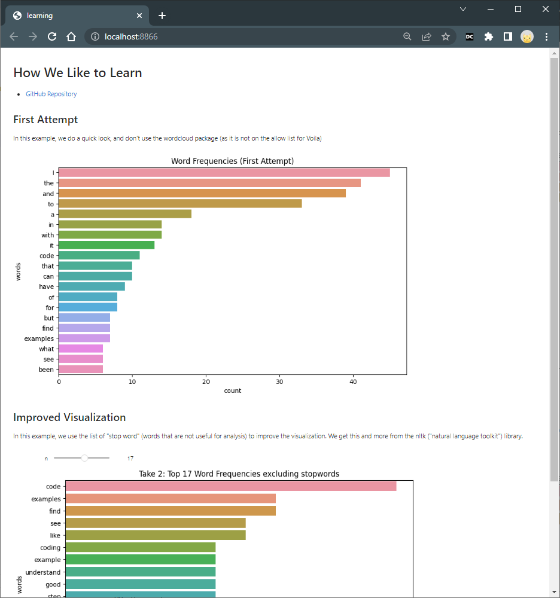

# Publish to Voilà 

Voilà and ipywidgets turn Jupyter notebooks into interactive web applications. 

## Install Voilà

**Deactivate** the virtual environment and 
install voila into your default Python environment. 

```shell
deactivate
python -m pip install --upgrade voila
```

## Run Voilà and View Notebook

Once installed, you can run `voila` in the terminal followed by the path to your notebook file. 
It will open <http://localhost:8866/> in your browser.

```shell
voila learning.ipynb 
```

## Deploy to Binder

Follow the instructions at [PUBLISH_TO_BINDER.md](./PUBLISH_TO_BINDER.md).
After Binder deployment, replace the "mybinder.org" part of your Binder URL with "voila.mybinder.org".

  - <https://mybinder.org/v2/gh/denisecase/datafun-03-discussion/HEAD?labpath=learning.ipynb>
  - <https://voila.mybinder.org/v2/gh/denisecase/datafun-03-discussion/HEAD?labpath=learning.ipynb>

## Voilà!

- Explore more examples at <https://voila-gallery.org/>.
- Create a Voilà badge with a clickable link to your notebook. See the [README.md](./README.md) or [this guide](https://mybinder.readthedocs.io/en/latest/howto/badges.html).
- [Voilà Example](https://voila.mybinder.org/v2/gh/denisecase/datafun-03-discussion/HEAD?labpath=learning.ipynb)

