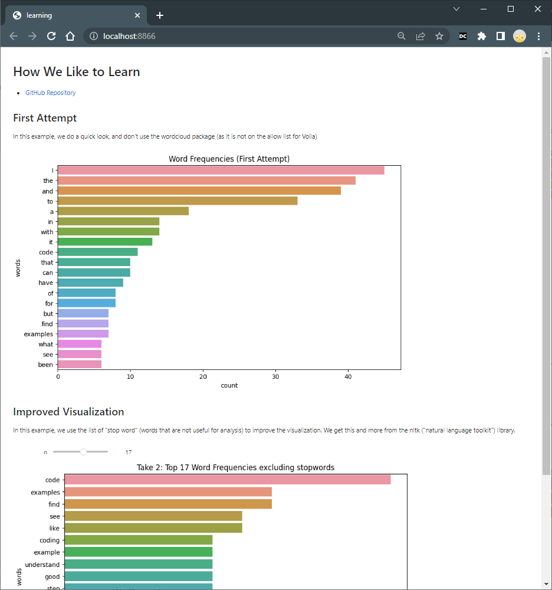
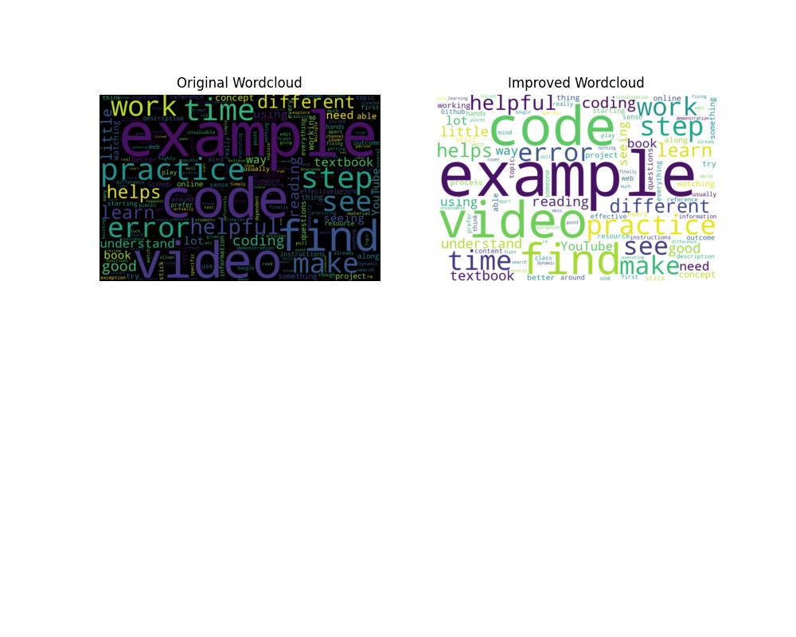
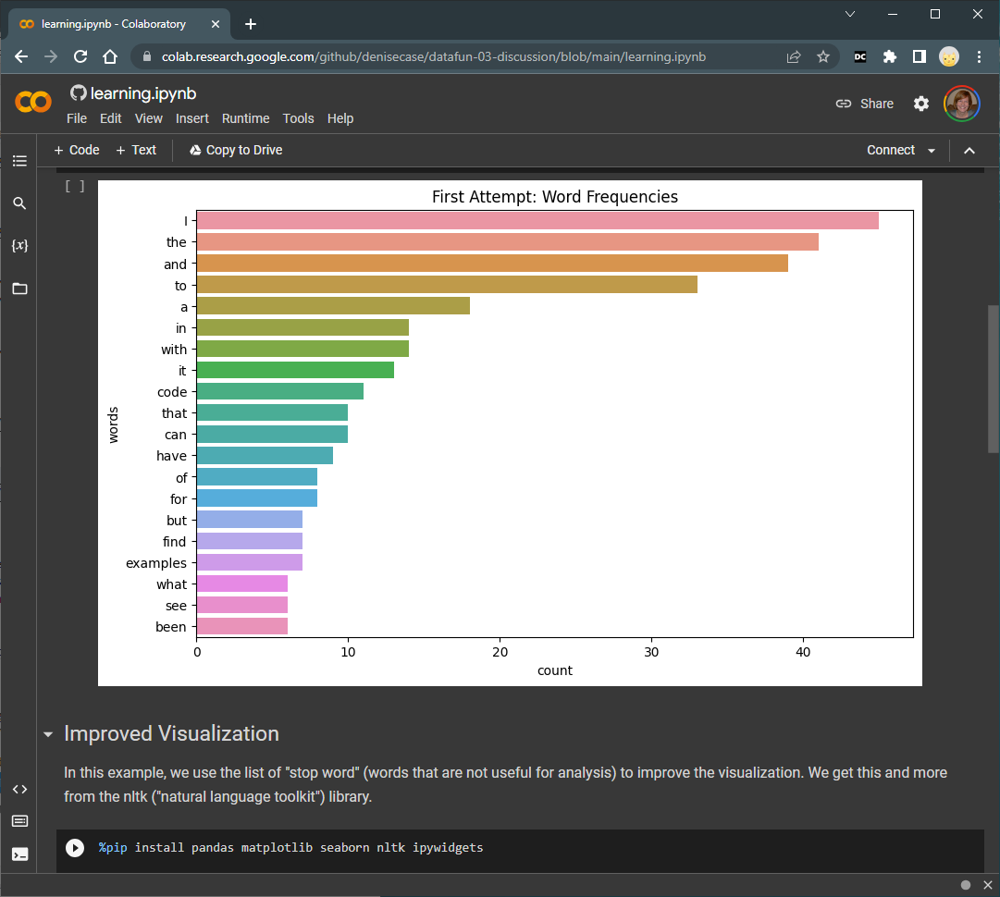

# datafun-03-discussion

[](https://mybinder.org/v2/gh/denisecase/datafun-03-discussion/HEAD?labpath=learning.ipynb)
[![badge](https://img.shields.io/badge/launch-voila-579ACA.svg?logo=data:image/png;base64,iVBORw0KGgoAAAANSUhEUgAAAFkAAABZCAMAAABi1XidAAAB8lBMVEX///9XmsrmZYH1olJXmsr1olJXmsrmZYH1olJXmsr1olJXmsrmZYH1olL1olJXmsr1olJXmsrmZYH1olL1olJXmsrmZYH1olJXmsr1olL1olJXmsrmZYH1olL1olJXmsrmZYH1olL1olL0nFf1olJXmsrmZYH1olJXmsq8dZb1olJXmsrmZYH1olJXmspXmspXmsr1olL1olJXmsrmZYH1olJXmsr1olL1olJXmsrmZYH1olL1olLeaIVXmsrmZYH1olL1olL1olJXmsrmZYH1olLna31Xmsr1olJXmsr1olJXmsrmZYH1olLqoVr1olJXmsr1olJXmsrmZYH1olL1olKkfaPobXvviGabgadXmsqThKuofKHmZ4Dobnr1olJXmsr1olJXmspXmsr1olJXmsrfZ4TuhWn1olL1olJXmsqBi7X1olJXmspZmslbmMhbmsdemsVfl8ZgmsNim8Jpk8F0m7R4m7F5nLB6jbh7jbiDirOEibOGnKaMhq+PnaCVg6qWg6qegKaff6WhnpKofKGtnomxeZy3noG6dZi+n3vCcpPDcpPGn3bLb4/Mb47UbIrVa4rYoGjdaIbeaIXhoWHmZYHobXvpcHjqdHXreHLroVrsfG/uhGnuh2bwj2Hxk17yl1vzmljzm1j0nlX1olL3AJXWAAAAbXRSTlMAEBAQHx8gICAuLjAwMDw9PUBAQEpQUFBXV1hgYGBkcHBwcXl8gICAgoiIkJCQlJicnJ2goKCmqK+wsLC4usDAwMjP0NDQ1NbW3Nzg4ODi5+3v8PDw8/T09PX29vb39/f5+fr7+/z8/Pz9/v7+zczCxgAABC5JREFUeAHN1ul3k0UUBvCb1CTVpmpaitAGSLSpSuKCLWpbTKNJFGlcSMAFF63iUmRccNG6gLbuxkXU66JAUef/9LSpmXnyLr3T5AO/rzl5zj137p136BISy44fKJXuGN/d19PUfYeO67Znqtf2KH33Id1psXoFdW30sPZ1sMvs2D060AHqws4FHeJojLZqnw53cmfvg+XR8mC0OEjuxrXEkX5ydeVJLVIlV0e10PXk5k7dYeHu7Cj1j+49uKg7uLU61tGLw1lq27ugQYlclHC4bgv7VQ+TAyj5Zc/UjsPvs1sd5cWryWObtvWT2EPa4rtnWW3JkpjggEpbOsPr7F7EyNewtpBIslA7p43HCsnwooXTEc3UmPmCNn5lrqTJxy6nRmcavGZVt/3Da2pD5NHvsOHJCrdc1G2r3DITpU7yic7w/7Rxnjc0kt5GC4djiv2Sz3Fb2iEZg41/ddsFDoyuYrIkmFehz0HR2thPgQqMyQYb2OtB0WxsZ3BeG3+wpRb1vzl2UYBog8FfGhttFKjtAclnZYrRo9ryG9uG/FZQU4AEg8ZE9LjGMzTmqKXPLnlWVnIlQQTvxJf8ip7VgjZjyVPrjw1te5otM7RmP7xm+sK2Gv9I8Gi++BRbEkR9EBw8zRUcKxwp73xkaLiqQb+kGduJTNHG72zcW9LoJgqQxpP3/Tj//c3yB0tqzaml05/+orHLksVO+95kX7/7qgJvnjlrfr2Ggsyx0eoy9uPzN5SPd86aXggOsEKW2Prz7du3VID3/tzs/sSRs2w7ovVHKtjrX2pd7ZMlTxAYfBAL9jiDwfLkq55Tm7ifhMlTGPyCAs7RFRhn47JnlcB9RM5T97ASuZXIcVNuUDIndpDbdsfrqsOppeXl5Y+XVKdjFCTh+zGaVuj0d9zy05PPK3QzBamxdwtTCrzyg/2Rvf2EstUjordGwa/kx9mSJLr8mLLtCW8HHGJc2R5hS219IiF6PnTusOqcMl57gm0Z8kanKMAQg0qSyuZfn7zItsbGyO9QlnxY0eCuD1XL2ys/MsrQhltE7Ug0uFOzufJFE2PxBo/YAx8XPPdDwWN0MrDRYIZF0mSMKCNHgaIVFoBbNoLJ7tEQDKxGF0kcLQimojCZopv0OkNOyWCCg9XMVAi7ARJzQdM2QUh0gmBozjc3Skg6dSBRqDGYSUOu66Zg+I2fNZs/M3/f/Grl/XnyF1Gw3VKCez0PN5IUfFLqvgUN4C0qNqYs5YhPL+aVZYDE4IpUk57oSFnJm4FyCqqOE0jhY2SMyLFoo56zyo6becOS5UVDdj7Vih0zp+tcMhwRpBeLyqtIjlJKAIZSbI8SGSF3k0pA3mR5tHuwPFoa7N7reoq2bqCsAk1HqCu5uvI1n6JuRXI+S1Mco54YmYTwcn6Aeic+kssXi8XpXC4V3t7/ADuTNKaQJdScAAAAAElFTkSuQmCC)](https://mybinder.org/v2/gh/denisecase/datafun-03-discussion/HEAD?urlpath=voila%2Frender%2Flearning.ipynb)

- [GitHub Repository](https://github.com/denisecase/datafun-03-discussion)
- [GitHub Repository: Notebook](./learning.ipynb)
- [Binder Notebook](https://mybinder.org/v2/gh/denisecase/datafun-03-discussion/HEAD?labpath=learning.ipynb)
- [Voila Interactive Notebook](https://mybinder.org/v2/gh/denisecase/datafun-03-discussion/HEAD?urlpath=voila%2Frender%2Flearning.ipynb)

-----

## Set Up Your Environment

In VS Code, open a Terminal / New Terminal and run the following command one at a time.
This will:

1. update important packages in our default Python
1. create a virtual environment in the `.venv` folder
1. activate the virtual environment
1. install an upgraded version of pip in our virtual environment
1. install upgraded versions of the packages listed in [requirements.txt](./requirements.txt)
1. set up the ipykernel to run Jupyter Notebooks locally in our .venv virtual environment
1. install the Jupyter Notebook Extensions Configurator

The commands are for Windows and PowerShell. 
Slight adjustments may be needed for other environments.
Click Yes when VS Code asks about the environment. 
Allow some time for each command to complete before running the next command. 

Note: If `python` doesn't work, replace it with `py` or `python3` in the commands.

```shell
python -m pip install --upgrade pip ipykernel jupyterlab 

python -m venv .venv

.venv\Scripts\Activate

python -m pip install --upgrade pip 

python -m pip install --upgrade -r requirements.txt

python -m ipykernel install --user --name .venv --display-name "Python (.venv)"

jupyter nbextensions_configurator enable --user  # can be skipped for notebook >=5.3
```

-----

## Run The Code

1. Run the script from the command line with `python learning.py`.
2. Open the notebook [learning.ipynb](./learning.ipynb). In the upper right, click Select Kernel / Python Environment, then choose the Python (.venv) from the menu. Once you have a kernel, run all the cells.

-----

## Exploratory Data Analysis in Daily Life

We asked: Which learning resources do you prefer/find most effective?

- One way to gain insight is to turn the discussion into a word cloud as we did in [learning.py](./learning.py).
- Another is to chart the most common words as we did in the [learning.ipynb](./learning.ipynb) notebook available in [.
- Could you add a third chart - or other analysis - to help gain insights?

-----

## Publishing (Deploying) Jupyter Notebooks

There are some great options for publishing/deploying notebooks for free.
Binder is easier.
Voila builds on Binder and enables interactive widgets.  

- Read [PUBLISH_TO_BINDER.md](./PUBLISH_TO_BINDER.md).
- Read [PUBLISH_WITH_VOILA.md](./PUBLISH_WITH_VOILA.md).
- Read [PUBLISH_TO_COLAB.md](./PUBLISH_TO_COLAB.md).

## ⚠️ Binder Rate Limits

Rate limits of 100 container image requests per six hours for anonymous usage, 
and 200 container image requests per six hours for free Docker accounts are in effect. 
Image requests exceeding these limits will be denied until the six hour window elapses.

-----

## Insights



## Google Colab

