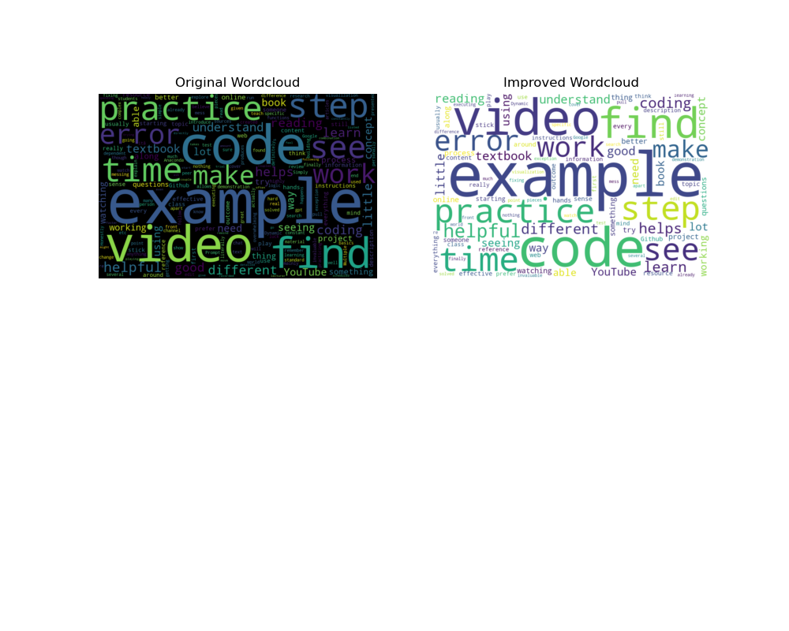

# datafun-03-discussion

## Recommended

- Miniconda3 for Python
- VS Code for editing
- VS Code Extension - Python
- VS Code Extension - Remote Repositories

## Install External Packages

```
conda install -c conda-forge wordcloud -y
conda install -c conda-forge matplotlib -y
```

## Run The Code

`python learning.py`

## Exploratory Data Analysis in Daily Life

In our third discussion, we asked:

- Which learning resources do you prefer/find most effective?

One way to gain insight is to turn the discussion into a word cloud.

## Questions

- How well did this process work?
- Could you add a third chart - or other analysis - to help gain insights?


## Insights


